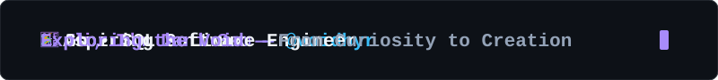

<!-- <h1 align="center">🌌 Voidhyr</h1> -->

<!-- 🌑 VOIDHYR THEME PROFILE README -->
<p align="center">
  
</p>

<p align="center">
  <strong>BUILD SOFTWARE &nbsp; · &nbsp; EXPLORE SYSTEMS &nbsp; · &nbsp; TEST IDEAS</strong>
</p>

```text
voidhyr {
    name:          "Dani Sam"
    aspiring_to:   "Software Engineer"
    building:      ["Small tools", "A particle simulation"]
    learning:      ["Rust", "Software development"]
    familiar_with: ["Go", "Python", "SQL", "Linux", "Git"]
    exploring: [
        "Computer systems"
        "WebAssembly"
        "Efficient computing"
    ]
    mindset: "Build it. Question it. Understand it."
}
```

<p align="center">
  Curious about how things work and what’s possible. Learning by building and experimenting.
</p>

<p align="center">
  
  
  
  
  
</p>

<p align="center">
  <a href="https://voidhyr.github.io/Personal-Website/">
    <strong>Enter the Void → Personal Site</strong>
  </a>
</p>

<p align="center">
  
</p>
<!-- <p align="center">  </p> -->

<!--
**dani-sam/dani-sam** is a ✨ _special_ ✨ repository because its `README.md` (this file) appears on your GitHub profile.

Here are some ideas to get you started:

- 🔭 I’m currently working on ...
- 🌱 I’m currently learning ...
- 👯 I’m looking to collaborate on ...
- 🤔 I’m looking for help with ...
- 💬 Ask me about ...
- 📫 How to reach me: ...
- 😄 Pronouns: ...
- ⚡ Fun fact: ...
-->
